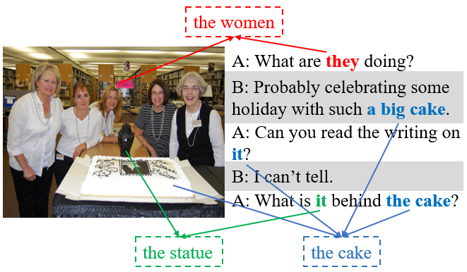
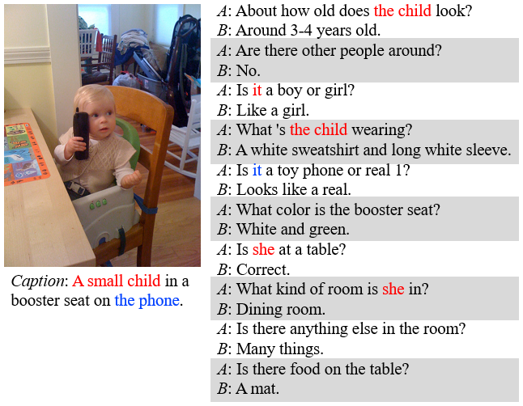
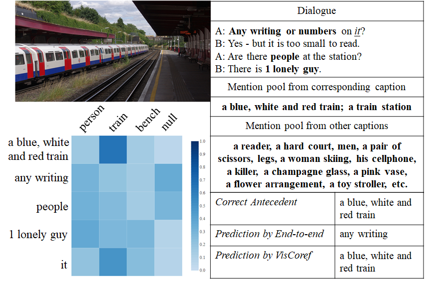

# Visual Pronoun Coreference Resolution in Dialogues

## Introduction
This is the data and the source code for EMNLP 2019 paper "What You See is What You Get: Visual Pronoun Coreference Resolution in Dialogues".

### Abstract
Grounding pronouns to a visual object it refers to requires complex reasoning from various information sources, especially in conversational scenarios.
For example, when people in a conversation talk about something all speakers can see (e.g., <b>the statue</b>), they often directly use pronouns (e.g., <b>it</b>) to refer it without previous introduction.
This fact brings a huge challenge for modern natural language understanding systems, particularly conventional context-based pronoun coreference models.
To tackle this challenge, in this paper, we formally define the task of visual-aware pronoun coreference resolution (PCR), and introduce VisPro, a large-scale dialogue PCR dataset, to investigate whether and how the visual information can help resolve pronouns in dialogues.
We then propose a novel visual-aware PCR model, VisCoref, for this task and conduct comprehensive experiments and case studies on our dataset.
Results demonstrate the importance of the visual information in this PCR case and show the effectiveness of the proposed model.

<div align=center>

</div>

The readers are welcome to star/fork this repository and use it to train your own model, reproduce our experiment, and follow our future work. Please kindly cite our paper:
```
@inproceedings{yu2019visualpcr,
  author    = {Xintong Yu and 
               Hongming Zhang and
               Yangqiu Song and
               Yan Song and
               Changshui Zhang},
  title     = {What You See is What You Get: Visual Pronoun Coreference Resolution in Dialogues},
  booktitle = {Proceedings of EMNLP, 2019},
  year      = {2019}
}
```


## VisPro Dataset
VisPro dataset contains coreference annotation of 29,722 pronouns from 5,000 dialogues.

The train, validation, and test split of VisPro dataset are in `data` directory.

### An example of VisPro
<div align=center>

</div>
Mentions in the same coreference cluster are in the same color.

### Annotation Format
Each line contains the annotation of one dialog.
```
{
    "doc_key": str,
    "image_file": str,
    "object_detection": list,
    "sentences": list,
    "speakers": list,
    "cluster": list,
    "correct_caption_NPs": list,
    "pronoun_info": list
}
```
`object_detection` contains the ids of object labels from 80 categories of MSCOCO object detection challenge.

Each element of `"pronoun_info"` contains the annotation of one pronoun.
```
{
    "current_pronoun": list,
    "reference_type": int,
    "not_discussed": bool,
    "candidate_NPs": list,
    "correct_NPs": list
}
```
Text spans are denoted as [index_start, index_end] of their positions in the whole dialogue.

`"current_pronoun"`, `"candidate_NPs"`, and `"correct_NPs"` are positions of the pronouns, the candidate noun phrases and the correct noun phrases of antecedents respectively.

`"reference_type"` has 3 values. 0 for pronouns which refers to noun phrases in the text, 1 for pronouns whose antecedents are not in the candidate list, 2 for non-referential pronouns.


## Usage of VisCoref

### An Example of VisCoref Prediction
<div align=center>

</div>

The figure shows an example of a VisCoref prediction with the image, the relevant part of the dialogue, the prediction result, and the heatmap of the text-object similarity. We indicate the target pronoun with the *underlined italics* font and the candidate mentions with <b>bold</b> font. The row of the heatmap represents the mention in the context and the column means the detected object labels from the image.

### Getting Started
* Install python 3.7 and the following requirements: `pip install -r requirements.txt`. Set default python under your system to python 3.7.
* Download supplementary data for training VisCoref and the pretrained model from [Data](https://drive.google.com/open?id=1dSeGz5k57bU2GXCt7sY9krykLvmnbiVx) and extract: `tar -xzvf VisCoref.tar.gz`.
* Move VisPro data and supplementary data end with `.jsonlines` to `data` directory and move the pretrained model to `logs` directory.
* Download GloVe embeddings and build custom kernels by running `setup_all.sh`.
    * There are 3 platform-dependent ways to build custom TensorFlow kernels. Please comment/uncomment the appropriate lines in the script.
* Setup training files by running `setup_training.sh`.

### Traning Instructions

* Experiment configurations are found in `experiments.conf`
* Choose an experiment that you would like to run, e.g. `best`
* For training and prediction, set the `GPU` environment variable, which the code treats as shorthand for `CUDA_VISIBLE_DEVICES`.
* Training: `python train.py <experiment>`
* Results are stored in the `logs` directory and can be viewed via TensorBoard.
* Prediction: `python predict.py <experiment>`
* Evaluation: `python evaluate.py <experiment>`

## Acknowledgment
VisPro dataset is based on [VisDial v1.0](https://visualdialog.org/).

We built the training framework based on the original [End-to-end Coreference Resolution](https://github.com/kentonl/e2e-coref).

## Others
If you have questions about the data or the code, you are welcome to open an issue or send me an email, I will respond to that as soon as possible.